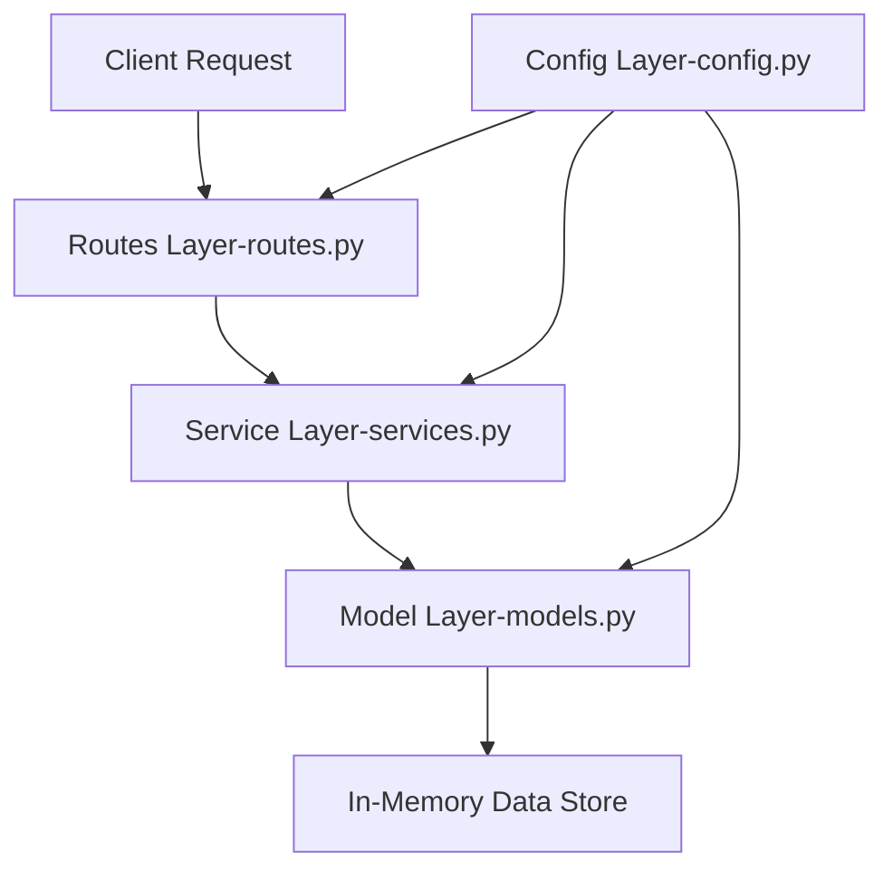

# Smart Parking System - Backend Technical Documentation

## Table of Contents
1. [Overview](#overview)
2. [Architecture](#architecture)
3. [File Structure](#file-structure)
4. [Configuration (`config.py`)](#configuration-configpy)
5. [Data Models (`models.py`)](#data-models-modelspy)
6. [Business Logic (`services.py`)](#business-logic-servicespy)
7. [API Routes (`routes.py`)](#api-routes-routespy)
8. [Application Entry Point (`app.py`)](#application-entry-point-apppy)
9. [Unit Tests (`tests.py`)](#unit-tests-testspy)
10. [API Reference](#api-reference)

---

## Overview

The Smart Parking System backend is a **RESTful API** built with **Python Flask** that provides parking slot management functionality. It supports:
- Real-time parking slot status tracking
- Slot booking with vehicle ID validation
- Slot release operations
- Booking history management
- Prevention of double bookings

### Technology Stack
| Component | Technology | Version |
|-----------|------------|---------|
| Framework | Flask | 3.0.0 |
| CORS | Flask-CORS | 4.0.0 |
| Language | Python | 3.8+ |

---

## Architecture

The backend follows a **layered architecture pattern** with clear separation of concerns:



### Design Patterns Used

1. **Singleton Pattern** - `ParkingLot` class ensures only one instance manages all parking data
2. **Blueprint Pattern** - API routes are organized using Flask Blueprints
3. **Service Layer Pattern** - Business logic is separated from route handlers
4. **Factory Pattern** - `create_app()` function creates Flask application instances

---

## File Structure

```
Backend/
├── __pycache__/          # Python bytecode cache
├── venv/                 # Virtual environment
├── app.py               # Application entry point (29 lines)
├── config.py            # Configuration settings (22 lines)
├── models.py            # Data models and storage (117 lines)
├── routes.py            # API route definitions (75 lines)
├── services.py          # Business logic layer (163 lines)
├── tests.py             # Unit tests (124 lines)
└── requirements.txt     # Dependencies (2 packages)
```

---

## Configuration (`config.py`)

The `Config` class centralizes all application configuration:

### Class Structure

```python
class Config:
    # Flask Configuration
    DEBUG = True
    HOST = '0.0.0.0'
    PORT = 5000
    
    # CORS Configuration
    CORS_ORIGINS = '*'
    
    # Parking Lot Configuration
    INITIAL_PARKING_DATA = {...}
    
    # History Configuration
    MAX_HISTORY_ENTRIES = 20
```

### Configuration Parameters

| Parameter | Type | Default | Description |
|-----------|------|---------|-------------|
| `DEBUG` | bool | `True` | Enable Flask debug mode |
| `HOST` | str | `'0.0.0.0'` | Server host address |
| `PORT` | int | `5000` | Server port number |
| `CORS_ORIGINS` | str | `'*'` | Allowed CORS origins |
| `MAX_HISTORY_ENTRIES` | int | `20` | Maximum history entries stored |

### Initial Parking Slots

The system initializes with **6 parking slots**:

| Slot ID | Zone | Initial Status |
|---------|------|----------------|
| A1 | Zone A | Available |
| A2 | Zone A | Available |
| B1 | Zone B | Available |
| B2 | Zone B | Available |
| C1 | Zone C | Available |
| C2 | Zone C | Available |

### Slot Data Structure

```python
{
    "status": True,        # True = available, False = occupied
    "vehicle_id": None,    # Vehicle ID when occupied
    "booked_at": None      # ISO timestamp when booked
}
```

---

## Data Models (`models.py`)

### ParkingLot Class (Singleton)

The `ParkingLot` class implements the **Singleton Pattern** with **thread-safe** operations.

#### Thread Safety Implementation

```python
class ParkingLot:
    _instance = None
    _lock = threading.Lock()
    
    def __new__(cls):
        if cls._instance is None:
            with cls._lock:
                if cls._instance is None:
                    cls._instance = super().__new__(cls)
                    cls._instance._initialized = False
        return cls._instance
```

**Double-checked locking** ensures thread-safe singleton instantiation.

#### Instance Attributes

| Attribute | Type | Description |
|-----------|------|-------------|
| `parking_lot` | dict | Current state of all parking slots |
| `booking_history` | list | List of all booking/release actions |
| `_initialized` | bool | Flag to prevent re-initialization |
| `_lock` | Lock | Thread lock for synchronization |

#### Methods

##### `get_all_slots() -> dict`
Returns a copy of all parking slots.
- **Thread-safe**: Yes
- **Returns**: Dictionary of all slots with their current state

##### `get_slot(slot_id: str) -> dict | None`
Retrieves a specific parking slot by ID.
- **Parameters**: `slot_id` - Slot identifier (e.g., "A1")
- **Returns**: Slot data dictionary or `None` if not found

##### `slot_exists(slot_id: str) -> bool`
Checks if a slot ID exists in the parking lot.
- **Returns**: `True` if slot exists, `False` otherwise

##### `is_slot_available(slot_id: str) -> bool`
Checks if a specific slot is available for booking.
- **Returns**: `True` if available, `False` if occupied or non-existent

##### `get_vehicle_slot(vehicle_id: str) -> str | None`
Finds which slot a specific vehicle is parked in.
- **Parameters**: `vehicle_id` - Vehicle identifier
- **Returns**: Slot ID string or `None` if vehicle not found

##### `book_slot(slot_id: str, vehicle_id: str) -> str`
Books a parking slot for a vehicle.
- **Parameters**: 
  - `slot_id` - Target slot
  - `vehicle_id` - Vehicle to park
- **Actions**:
  1. Sets slot status to `False` (occupied)
  2. Assigns vehicle_id to slot
  3. Records booking timestamp
  4. Adds entry to booking history
- **Returns**: ISO timestamp of booking

##### `release_slot(slot_id: str) -> str`
Releases an occupied parking slot.
- **Actions**:
  1. Sets slot status to `True` (available)
  2. Clears vehicle_id
  3. Clears booked_at timestamp
  4. Adds entry to booking history
- **Returns**: Vehicle ID that was parked

##### `get_statistics() -> dict`
Returns parking lot statistics.
- **Returns**: 
```python
{
    "total": int,      # Total number of slots
    "available": int,  # Number of available slots
    "occupied": int    # Number of occupied slots
}
```

##### `get_available_slots() -> list`
Returns list of available slot IDs.
- **Returns**: List of strings (e.g., `["A1", "B2", "C1"]`)

##### `get_history(limit: int = None) -> list`
Returns booking history.
- **Parameters**: `limit` - Maximum entries to return (optional)
- **Returns**: List of history entries (most recent last)

#### History Entry Structure

```python
{
    "action": "book" | "release",
    "slot_id": str,
    "vehicle_id": str,
    "timestamp": str  # ISO format
}
```

---

## Business Logic (`services.py`)

### ParkingService Class

The service layer handles **validation** and **business rules**.

#### Constructor

```python
def __init__(self):
    self.parking_lot = ParkingLot()  # Gets singleton instance
```

#### Methods

##### `get_parking_status() -> dict`

Returns formatted parking status for API response.

**Response Structure:**
```python
{
    "slots": [
        {
            "slot_id": "A1",
            "status": "available" | "occupied",
            "vehicle_id": str | None,
            "booked_at": str | None
        },
        ...
    ],
    "available_count": int,
    "total_count": int
}
```

##### `book_parking_slot(slot_id: str, vehicle_id: str) -> dict`

Books a slot with comprehensive validation.

**Validation Steps:**
1. Check for missing slot_id or vehicle_id → `400 Bad Request`
2. Normalize inputs (trim whitespace, uppercase)
3. Check if slot exists → `404 Not Found`
4. Check if slot is available → `409 Conflict`
5. Check if vehicle is already parked → `409 Conflict`
6. Validate vehicle_id format with regex → `400 Bad Request`

**Vehicle ID Validation Regex:**
```python
pattern = r"^[A-Z0-9-]{5,15}$"
```
- Alphanumeric characters and hyphens only
- Length between 5-15 characters
- Examples: `MH-01-AB-1234`, `KA05XY9999`

**Success Response:**
```python
{
    "success": True,
    "message": "Slot 'A1' successfully booked for vehicle 'MH-01-AB-1234'",
    "slot_id": "A1",
    "vehicle_id": "MH-01-AB-1234",
    "booked_at": "2024-01-15T10:30:00.123456",
    "status_code": 200
}
```

**Error Responses:**

| Scenario | Status Code | Message |
|----------|-------------|---------|
| Missing input | 400 | "Missing slot_id or vehicle_id" |
| Empty vehicle ID | 400 | "Vehicle ID cannot be empty" |
| Invalid slot | 404 | "Slot 'X1' does not exist" |
| Slot occupied | 409 | "Slot 'A1' is already occupied" |
| Vehicle already parked | 409 | "Vehicle 'XYZ' is already parked in slot 'B1'" |
| Invalid format | 400 | "Invalid Vehicle ID format..." |

##### `release_parking_slot(slot_id: str) -> dict`

Releases an occupied slot.

**Validation Steps:**
1. Check for missing slot_id → `400 Bad Request`
2. Normalize input (trim, uppercase)
3. Check if slot exists → `404 Not Found`
4. Check if slot is occupied → `409 Conflict`

**Success Response:**
```python
{
    "success": True,
    "message": "Slot 'A1' has been released",
    "slot_id": "A1",
    "vehicle_id": "MH-01-AB-1234",
    "status_code": 200
}
```

##### `get_booking_history(limit: int = 20) -> dict`

Returns booking history with optional limit.

```python
{
    "success": True,
    "history": [...],
    "status_code": 200
}
```

##### `get_available_slots() -> dict`

Returns all currently available slots.

```python
{
    "success": True,
    "available_slots": ["A1", "B2", "C1"],
    "count": 3,
    "status_code": 200
}
```

---

## API Routes (`routes.py`)

### Blueprint Configuration

```python
api_bp = Blueprint('api', __name__, url_prefix='/api')
```

All endpoints are prefixed with `/api`.

### Endpoint Summary

| Method | Endpoint | Description |
|--------|----------|-------------|
| GET | `/api/parking/status` | Get all parking slots status |
| POST | `/api/parking/book` | Book a parking slot |
| POST | `/api/parking/release` | Release a parking slot |
| GET | `/api/parking/history` | Get booking history |
| GET | `/api/parking/available` | Get available slots |
| GET | `/api/health` | Health check |

### Route Details

#### GET `/api/parking/status`

**Description:** Get current status of all parking slots

**Request:** None

**Response (200 OK):**
```json
{
    "success": true,
    "slots": [
        {
            "slot_id": "A1",
            "status": "available",
            "vehicle_id": null,
            "booked_at": null
        }
    ],
    "available_count": 5,
    "total_count": 6
}
```

#### POST `/api/parking/book`

**Description:** Book a parking slot

**Request Body:**
```json
{
    "slot_id": "A1",
    "vehicle_id": "MH-01-AB-1234"
}
```

**Response (200 OK):**
```json
{
    "success": true,
    "message": "Slot 'A1' successfully booked for vehicle 'MH-01-AB-1234'",
    "slot_id": "A1",
    "vehicle_id": "MH-01-AB-1234",
    "booked_at": "2024-01-15T10:30:00.123456"
}
```

**Error Responses:** 400, 404, 409

#### POST `/api/parking/release`

**Description:** Release an occupied parking slot

**Request Body:**
```json
{
    "slot_id": "A1"
}
```

**Response (200 OK):**
```json
{
    "success": true,
    "message": "Slot 'A1' has been released",
    "slot_id": "A1",
    "vehicle_id": "MH-01-AB-1234"
}
```

#### GET `/api/parking/history`

**Description:** Get booking history

**Response (200 OK):**
```json
{
    "success": true,
    "history": [
        {
            "action": "book",
            "slot_id": "A1",
            "vehicle_id": "MH-01-AB-1234",
            "timestamp": "2024-01-15T10:30:00.123456"
        }
    ]
}
```

#### GET `/api/parking/available`

**Description:** Get list of available slots

**Response (200 OK):**
```json
{
    "success": true,
    "available_slots": ["A1", "B2", "C1"],
    "count": 3
}
```

#### GET `/api/health`

**Description:** Health check endpoint

**Response (200 OK):**
```json
{
    "success": true,
    "message": "Smart Parking System API is running"
}
```

---

## Application Entry Point (`app.py`)

### Application Factory Pattern

```python
def create_app():
    app = Flask(__name__)
    
    # Load configuration
    app.config.from_object(Config)
    
    # Enable CORS
    CORS(app, origins=Config.CORS_ORIGINS)
    
    # Register blueprints
    app.register_blueprint(api_bp)
    
    return app
```

### Main Execution

```python
if __name__ == '__main__':
    app = create_app()
    app.run(
        debug=Config.DEBUG,
        host=Config.HOST,
        port=Config.PORT
    )
```

### Server Configuration
- **Debug Mode:** Enabled by default
- **Host:** `0.0.0.0` (accessible from any network interface)
- **Port:** `5000`

---

## Unit Tests (`tests.py`)

### Test Framework

Uses Python's built-in `unittest` framework.

### Test Class: `TestBackend`

#### Setup Method

```python
def setUp(self):
    self.app = create_app()
    self.app.config['TESTING'] = True
    self.client = self.app.test_client()
    
    # Reset singleton for clean test state
    ParkingLot._instance = None
    self.parking_lot = ParkingLot()
```

**Important:** The singleton is reset before each test to ensure test isolation.

### Test Cases

| Test ID | Test Name | Description | Expected Result |
|---------|-----------|-------------|-----------------|
| 01 | `test_01_health_check` | Verify API is running | 200 OK with success message |
| 02 | `test_02_initial_status` | Fetch initial parking status | Slots array with counts |
| 03 | `test_03_successful_booking` | Book a valid empty slot | 200 OK, booking confirmed |
| 04 | `test_04_prevent_double_booking` | Try booking occupied slot | 409 Conflict |
| 05 | `test_05_release_slot` | Release a booked slot | 200 OK, slot released |
| 06 | `test_06_invalid_input` | Send empty JSON | 400 Bad Request |
| 07 | `test_07_vehicle_id_constraint` | Use invalid vehicle ID format | 400 Bad Request |

### Running Tests

```bash
cd Backend
python -m unittest tests.py -v
```

### Test Coverage

- ✅ Health check endpoint
- ✅ Initial status retrieval
- ✅ Successful booking flow
- ✅ Double booking prevention
- ✅ Slot release functionality
- ✅ Input validation (empty data)
- ✅ Vehicle ID format validation

---

## API Reference

### Base URL

```
http://localhost:5000/api
```

### HTTP Status Codes

| Code | Description |
|------|-------------|
| 200 | Success |
| 400 | Bad Request (validation error) |
| 404 | Not Found (slot doesn't exist) |
| 409 | Conflict (double booking / already released) |
| 500 | Internal Server Error |

### Common Response Structure

**Success:**
```json
{
    "success": true,
    "message": "Operation description",
    "...": "additional data"
}
```

**Error:**
```json
{
    "success": false,
    "message": "Error description"
}
```

---

## Dependencies

### requirements.txt

```
Flask==3.0.0
Flask-CORS==4.0.0
```

### Installation

```bash
cd Backend
pip install -r requirements.txt
```

---

## Running the Backend

### Development Server

```bash
cd Backend
python app.py
```

Server will start at: `http://localhost:5000`

### Production Considerations

For production deployment, consider:
1. Using a production WSGI server (Gunicorn, uWSGI)
2. Setting `DEBUG = False`
3. Using a persistent database instead of in-memory storage
4. Implementing proper authentication/authorization
5. Configuring secure CORS origins

---