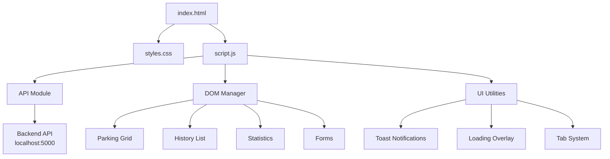
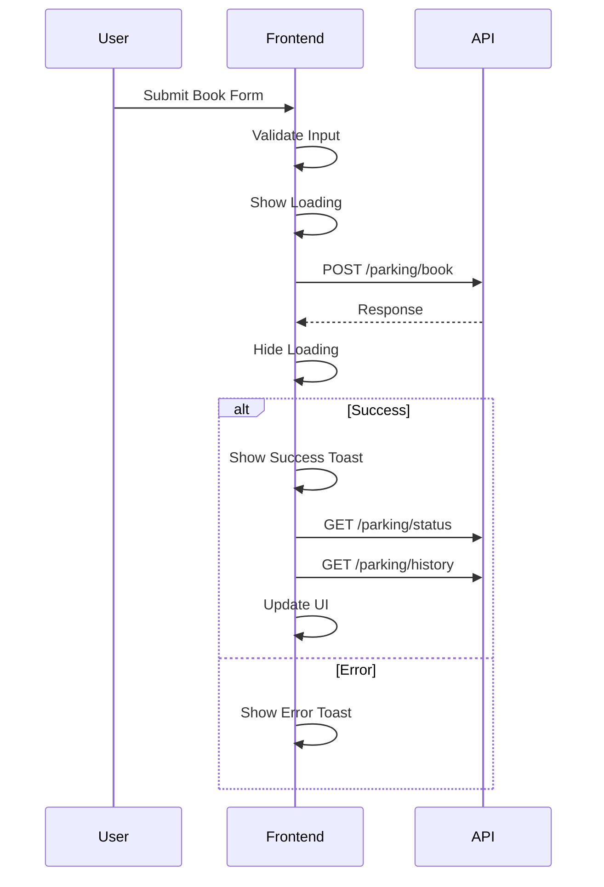

# Smart Parking System - Frontend Technical Documentation

## Table of Contents
1. [Overview](#overview)
2. [Architecture](#architecture)
3. [File Structure](#file-structure)
4. [HTML Structure (`index.html`)](#html-structure-indexhtml)
5. [Styling System (`styles.css`)](#styling-system-stylescss)
6. [JavaScript Application (`script.js`)](#javascript-application-scriptjs)
7. [API Integration](#api-integration)
8. [Component Reference](#component-reference)
9. [Animation System](#animation-system)
10. [Responsive Design](#responsive-design)

---

## Overview

The Smart Parking System frontend is a **modern, responsive Single Page Application (SPA)** built with vanilla web technologies. It provides a real-time interface for managing parking slots with a sleek dark theme and glassmorphism design.

### Technology Stack

| Component | Technology |
|-----------|------------|
| Structure | HTML5 |
| Styling | CSS3 (with CSS Variables) |
| Logic | Vanilla JavaScript (ES6+) |
| Font | Inter (Google Fonts) |
| Icons | Native Emoji |

### Browser Support

- Chrome 80+
- Firefox 75+
- Safari 14+
- Edge 80+

---

## Architecture



### Design Philosophy

1. **No Build Tools** - Direct browser execution without bundlers
2. **No Dependencies** - Pure vanilla implementation
3. **Module Pattern** - Organized code structure in single file
4. **Event-Driven** - Reactive to user interactions and API responses

---

## File Structure

```
Frontend/
├── README.md           # Quick reference guide (65 lines)
├── index.html          # Main HTML document (134 lines)
├── styles.css          # Complete styling (774 lines)
└── script.js           # Application logic (349 lines)
```

---

## HTML Structure (`index.html`)

### Document Head

```html
<!DOCTYPE html>
<html lang="en">
<head>
    <meta charset="UTF-8" />
    <meta name="viewport" content="width=device-width, initial-scale=1.0" />
    <title>Smart Parking System</title>
    <meta name="description" content="Intelligent parking slot management...">
    <link rel="stylesheet" href="styles.css" />
</head>
```

**SEO Optimizations:**
- Semantic HTML5 structure
- Meta description for search engines
- Viewport meta for mobile responsiveness

### Layout Hierarchy

```
body
└── .container
    ├── header.header
    │   ├── .header-content (h1, .subtitle)
    │   └── .stats-container (3× .stat-card)
    ├── main.main-content
    │   ├── section.action-panel
    │   │   ├── .panel-header
    │   │   ├── .action-tabs (2× .tab-button)
    │   │   ├── #book-tab.tab-content
    │   │   │   └── form#bookForm
    │   │   └── #release-tab.tab-content
    │   │       └── form#releaseForm
    │   ├── section.parking-section
    │   │   ├── .section-header
    │   │   └── #parkingGrid.parking-grid
    │   └── section.history-section
    │       ├── .section-header
    │       └── #historyList.history-list
    ├── #toast.toast (notification)
    └── #loadingOverlay.loading-overlay
```

### Key DOM Elements

#### Statistics Cards
```html
<div class="stats-container">
    <div class="stat-card">
        <div class="stat-value" id="availableCount">0</div>
        <div class="stat-label">Available</div>
    </div>
    <!-- occupiedCount, totalCount -->
</div>
```

#### Booking Form
```html
<form id="bookForm" class="action-form">
    <div class="form-group">
        <label for="bookSlotId">Slot ID</label>
        <select id="bookSlotId" required>
            <option value="">Select a slot</option>
        </select>
    </div>
    <div class="form-group">
        <label for="vehicleId">Vehicle ID</label>
        <input 
            type="text" 
            id="vehicleId" 
            placeholder="e.g., MH-01-AB-1234" 
            pattern="[A-Za-z0-9-]{5,15}"
            minlength="5"
            maxlength="15"
            oninput="this.value = this.value.toUpperCase()"
            title="Vehicle ID must be 5-15 characters"
            required
        >
    </div>
    <button type="submit" class="btn btn-primary">Book Slot</button>
</form>
```

**Input Validation Attributes:**
- `pattern` - Regex for allowed characters
- `minlength` / `maxlength` - Length constraints
- `oninput` - Auto-uppercase transformation
- `required` - Mandatory field

---

## Styling System (`styles.css`)

### CSS Custom Properties (Variables)

```css
:root {
    /* Primary Colors */
    --primary-color: #6366f1;
    --primary-dark: #4f46e5;
    --primary-light: #818cf8;
    
    /* Status Colors */
    --success-color: #10b981;
    --success-dark: #059669;
    --danger-color: #ef4444;
    --danger-dark: #dc2626;
    --warning-color: #f59e0b;
    
    /* Background Colors */
    --bg-primary: #0f172a;
    --bg-secondary: #1e293b;
    --bg-tertiary: #334155;
    
    /* Text Colors */
    --text-primary: #f1f5f9;
    --text-secondary: #cbd5e1;
    --text-muted: #94a3b8;
    
    /* Other */
    --border-color: #475569;
    --shadow-sm/md/lg/xl: ...;
    --transition-fast/normal/slow: ...;
}
```

### Color Palette

| Purpose | Variable | Hex | Usage |
|---------|----------|-----|-------|
| Primary | `--primary-color` | #6366f1 | Buttons, accents |
| Success | `--success-color` | #10b981 | Available slots |
| Danger | `--danger-color` | #ef4444 | Occupied slots, delete |
| Warning | `--warning-color` | #f59e0b | Warnings |
| Background | `--bg-primary` | #0f172a | Main body |
| Text | `--text-primary` | #f1f5f9 | Headings |

### Glassmorphism Effects

```css
.header {
    background: linear-gradient(135deg, 
        rgba(99, 102, 241, 0.1) 0%, 
        rgba(139, 92, 246, 0.1) 100%);
    backdrop-filter: blur(10px);
    border: 1px solid rgba(99, 102, 241, 0.2);
}
```

**Glassmorphism Properties:**
1. Semi-transparent gradient backgrounds
2. `backdrop-filter: blur()` for frosted glass effect
3. Subtle border with transparency
4. Box shadows for depth

### Button System

#### Button Base
```css
.btn {
    padding: 0.875rem 1.5rem;
    border: none;
    border-radius: 10px;
    font-weight: 600;
    cursor: pointer;
    transition: all var(--transition-normal);
    position: relative;
    overflow: hidden;
}
```

#### Button Variants

| Class | Gradient | Usage |
|-------|----------|-------|
| `.btn-primary` | `#6366f1 → #8b5cf6` | Book action |
| `.btn-danger` | `#ef4444 → #dc2626` | Release action |
| `.btn-secondary` | White/10% | Refresh |

#### Ripple Effect
```css
.btn::before {
    content: '';
    position: absolute;
    top: 50%;
    left: 50%;
    width: 0;
    height: 0;
    border-radius: 50%;
    background: rgba(255, 255, 255, 0.2);
    transform: translate(-50%, -50%);
    transition: width 0.6s, height 0.6s;
}

.btn:hover::before {
    width: 300px;
    height: 300px;
}
```

### Parking Slot Cards

#### Available Slot
```css
.parking-slot.available {
    border-color: var(--success-color);
    background: rgba(16, 185, 129, 0.05);
}
```

#### Occupied Slot
```css
.parking-slot.occupied {
    border-color: var(--danger-color);
    background: rgba(239, 68, 68, 0.05);
}
```

#### Hover Animation
```css
.parking-slot::before {
    content: '';
    position: absolute;
    top: 0;
    left: 0;
    right: 0;
    height: 4px;
    background: linear-gradient(90deg, 
        transparent, var(--primary-color), transparent);
    transform: translateX(-100%);
    transition: transform 0.6s;
}

.parking-slot:hover::before {
    transform: translateX(100%);
}
```

---

## JavaScript Application (`script.js`)

### Configuration

```javascript
const API_BASE_URL = 'http://localhost:5000/api';
```

### State Management

```javascript
let parkingData = [];   // Current parking slots
let historyData = [];   // Booking history
```

### DOM Element References

```javascript
const elements = {
    parkingGrid: document.getElementById('parkingGrid'),
    historyList: document.getElementById('historyList'),
    bookForm: document.getElementById('bookForm'),
    releaseForm: document.getElementById('releaseForm'),
    bookSlotId: document.getElementById('bookSlotId'),
    releaseSlotId: document.getElementById('releaseSlotId'),
    vehicleId: document.getElementById('vehicleId'),
    refreshBtn: document.getElementById('refreshBtn'),
    availableCount: document.getElementById('availableCount'),
    occupiedCount: document.getElementById('occupiedCount'),
    totalCount: document.getElementById('totalCount'),
    toast: document.getElementById('toast'),
    toastIcon: document.getElementById('toastIcon'),
    toastMessage: document.getElementById('toastMessage'),
    loadingOverlay: document.getElementById('loadingOverlay'),
    tabButtons: document.querySelectorAll('.tab-button'),
    tabContents: document.querySelectorAll('.tab-content')
};
```

### Application Initialization

```javascript
document.addEventListener('DOMContentLoaded', () => {
    initializeEventListeners();
    loadParkingStatus();
    loadHistory();
    
    // Auto-refresh every 30 seconds
    setInterval(() => {
        loadParkingStatus();
        loadHistory();
    }, 30000);
});
```

### Core Functions

#### `initializeEventListeners()`

Sets up all event handlers:
- Tab button clicks → `switchTab()`
- Book form submit → `handleBooking()`
- Release form submit → `handleRelease()`
- Refresh button click → Reload data

#### `switchTab(tabName)`

Controls tab visibility:
```javascript
function switchTab(tabName) {
    elements.tabButtons.forEach(btn => {
        btn.classList.toggle('active', btn.dataset.tab === tabName);
    });

    elements.tabContents.forEach(content => {
        content.classList.toggle('active', content.id === `${tabName}-tab`);
    });
}
```

#### `fetchAPI(endpoint, options)`

Generic API wrapper with error handling:
```javascript
async function fetchAPI(endpoint, options = {}) {
    try {
        showLoading(true);
        const response = await fetch(`${API_BASE_URL}${endpoint}`, {
            headers: {
                'Content-Type': 'application/json',
                ...options.headers
            },
            ...options
        });

        const data = await response.json();
        
        if (!response.ok) {
            throw new Error(data.message || 'Request failed');
        }

        return data;
    } catch (error) {
        console.error('API Error:', error);
        showToast(error.message || 'Network error occurred', 'error', '❌');
        throw error;
    } finally {
        showLoading(false);
    }
}
```

**Features:**
- Automatic loading overlay
- JSON content type header
- Error message extraction
- Toast notification for errors

#### `loadParkingStatus()`

Fetches and renders parking slots:
```javascript
async function loadParkingStatus() {
    try {
        const data = await fetchAPI('/parking/status');
        
        if (data.success) {
            parkingData = data.slots;
            updateParkingGrid(data.slots);
            updateStats(data.available_count, data.total_count);
            updateSlotDropdowns(data.slots);
        }
    } catch (error) {
        console.error('Failed to load parking status:', error);
    }
}
```

#### `updateParkingGrid(slots)`

Renders parking slot cards:
```javascript
function updateParkingGrid(slots) {
    elements.parkingGrid.innerHTML = slots.map(slot => {
        const isAvailable = slot.status === 'available';
        const statusClass = isAvailable ? 'available' : 'occupied';
        
        return `
            <div class="parking-slot ${statusClass}" 
                 data-slot-id="${slot.slot_id}">
                <div class="slot-header">
                    <div class="slot-id">${slot.slot_id}</div>
                    <span class="slot-status ${statusClass}">
                        ${isAvailable ? 'Available' : 'Occupied'}
                    </span>
                </div>
                <div class="slot-details">
                    ${!isAvailable ? `
                        <div class="slot-vehicle">🚗 ${slot.vehicle_id}</div>
                        <div class="slot-time">⏰ ${formatDateTime(slot.booked_at)}</div>
                    ` : `
                        <div class="slot-info">✓ Ready to book</div>
                    `}
                </div>
            </div>
        `;
    }).join('');
}
```

#### `updateSlotDropdowns(slots)`

Populates select elements:
```javascript
function updateSlotDropdowns(slots) {
    // Book dropdown - available slots only
    const availableSlots = slots.filter(s => s.status === 'available');
    elements.bookSlotId.innerHTML = 
        '<option value="">Select a slot</option>' +
        availableSlots.map(s => 
            `<option value="${s.slot_id}">${s.slot_id}</option>`
        ).join('');

    // Release dropdown - occupied slots only
    const occupiedSlots = slots.filter(s => s.status === 'occupied');
    elements.releaseSlotId.innerHTML = 
        '<option value="">Select a slot</option>' +
        occupiedSlots.map(s => 
            `<option value="${s.slot_id}">${s.slot_id} - ${s.vehicle_id}</option>`
        ).join('');
}
```

#### `handleBooking(e)`

Processes booking form submission:
```javascript
async function handleBooking(e) {
    e.preventDefault();

    const slotId = elements.bookSlotId.value.trim();
    const vehicleId = elements.vehicleId.value.trim();

    if (!slotId || !vehicleId) {
        showToast('Please fill in all fields', 'warning', '⚠️');
        return;
    }

    try {
        const data = await fetchAPI('/parking/book', {
            method: 'POST',
            body: JSON.stringify({ slot_id: slotId, vehicle_id: vehicleId })
        });

        if (data.success) {
            showToast(data.message, 'success', '✅');
            elements.bookForm.reset();
            await loadParkingStatus();
            await loadHistory();
        }
    } catch (error) {
        // Error handled in fetchAPI
    }
}
```

#### `handleRelease(e)`

Processes release form submission:
```javascript
async function handleRelease(e) {
    e.preventDefault();

    const slotId = elements.releaseSlotId.value.trim();

    if (!slotId) {
        showToast('Please select a slot', 'warning', '⚠️');
        return;
    }

    try {
        const data = await fetchAPI('/parking/release', {
            method: 'POST',
            body: JSON.stringify({ slot_id: slotId })
        });

        if (data.success) {
            showToast(data.message, 'success', '✅');
            elements.releaseForm.reset();
            await loadParkingStatus();
            await loadHistory();
        }
    } catch (error) {
        // Error handled in fetchAPI
    }
}
```

### Utility Functions

#### `formatDateTime(isoString)`

Human-readable relative timestamps:
```javascript
function formatDateTime(isoString) {
    if (!isoString) return '';
    
    const date = new Date(isoString);
    const now = new Date();
    const diffMs = now - date;
    
    if (diffMs < 0 || diffMs < 60000) return 'Just now';

    const diffMins = Math.floor(diffMs / 60000);
    const diffHours = Math.floor(diffMs / 3600000);
    const diffDays = Math.floor(diffMs / 86400000);

    if (diffMins < 60) return `${diffMins} min${diffMins > 1 ? 's' : ''} ago`;
    if (diffHours < 24) return `${diffHours} hour${diffHours > 1 ? 's' : ''} ago`;
    if (diffDays < 7) return `${diffDays} day${diffDays > 1 ? 's' : ''} ago`;

    return date.toLocaleString('en-US', {
        month: 'short',
        day: 'numeric',
        hour: '2-digit',
        minute: '2-digit'
    });
}
```

#### `showToast(message, type, icon)`

Displays notification:
```javascript
function showToast(message, type = 'success', icon = '✅') {
    elements.toastIcon.textContent = icon;
    elements.toastMessage.textContent = message;
    elements.toast.className = `toast ${type} show`;

    setTimeout(() => {
        elements.toast.classList.remove('show');
    }, 4000);
}
```

**Toast Types:** `success`, `error`, `warning`

#### `showLoading(show)`

Controls loading overlay:
```javascript
function showLoading(show) {
    if (show) {
        elements.loadingOverlay.classList.add('show');
    } else {
        elements.loadingOverlay.classList.remove('show');
    }
}
```

#### `animateValue(element, start, end, duration)`

Number animation for statistics:
```javascript
function animateValue(element, start, end, duration) {
    const range = end - start;
    const increment = range / (duration / 16);
    let current = start;

    const timer = setInterval(() => {
        current += increment;
        if ((increment > 0 && current >= end) || 
            (increment < 0 && current <= end)) {
            current = end;
            clearInterval(timer);
        }
        element.textContent = Math.round(current);
    }, 16);
}
```

### Global Error Handler

```javascript
window.addEventListener('unhandledrejection', (event) => {
    console.error('Unhandled promise rejection:', event.reason);
    showToast('An unexpected error occurred', 'error', '❌');
});
```

---

## API Integration

### Endpoints Used

| Method | Endpoint | Function |
|--------|----------|----------|
| GET | `/parking/status` | `loadParkingStatus()` |
| POST | `/parking/book` | `handleBooking()` |
| POST | `/parking/release` | `handleRelease()` |
| GET | `/parking/history` | `loadHistory()` |

### Request Flow



---

## Component Reference

### Statistics Cards

Dynamic counters with animation:
- Available count
- Occupied count
- Total slots

### Action Panel

Tabbed interface for:
- Book Slot form
- Release Slot form

### Parking Grid

Responsive grid of slot cards showing:
- Slot ID (A1, B1, etc.)
- Status badge (Available/Occupied)
- Vehicle ID (when occupied)
- Booking time (when occupied)

### History List

Scrollable list of activities:
- Action icon (🅿️ book / 🚪 release)
- Slot ID
- Vehicle ID
- Relative timestamp

### Toast Notifications

Position: Bottom-right
Duration: 4 seconds
Types: Success, Error, Warning

### Loading Overlay

Full-screen overlay with spinner during API calls.

---

## Animation System

### CSS Keyframes

| Animation | Description | Duration |
|-----------|-------------|----------|
| `fadeIn` | Opacity 0→1 | Variable |
| `fadeInDown` | Slide down + fade | 0.6s |
| `slideInLeft` | Slide from left | 0.4s |
| `slideInRight` | Slide from right | 0.4s |
| `spin` | Continuous rotation | 0.8s |

### Transitions

```css
--transition-fast: 150ms ease-in-out;
--transition-normal: 250ms ease-in-out;
--transition-slow: 350ms ease-in-out;
```

### Hover Effects

- Stat cards: Lift (`translateY(-4px)`)
- Parking slots: Lift + gradient sweep
- Buttons: Ripple effect + scale
- History items: Slide right

---

## Responsive Design

### Breakpoints

| Breakpoint | Target |
|------------|--------|
| 1024px | Tablets (landscape) |
| 768px | Tablets (portrait) |
| 480px | Mobile phones |

### Layout Changes

#### > 1024px (Desktop)
- 2-column grid layout
- Sticky action panel
- Full-width history

#### ≤ 1024px (Tablet)
- Single column layout
- Action panel flows normally
- Smaller parking cards

#### ≤ 768px (Mobile)
- Reduced padding
- 3-column stats grid
- History items stack vertically
- Toast spans full width

#### ≤ 480px (Small Mobile)
- Single column stats
- Vertical action tabs
- Simplified layout

---

## Running the Frontend

### Option 1: Direct File
```bash
# Windows
start index.html

# macOS
open index.html
```

### Option 2: Python Server
```bash
cd Frontend
python -m http.server 8000
# Visit http://localhost:8000
```

### Option 3: Node.js Server
```bash
cd Frontend
npx http-server -p 8000
```

---

## Configuration

### Changing API URL

Edit `script.js` line 2:
```javascript
const API_BASE_URL = 'http://your-server.com/api';
```

### Modifying Auto-Refresh Interval

Edit `script.js` line 36:
```javascript
setInterval(() => {
    loadParkingStatus();
    loadHistory();
}, 60000);  // Change to 60 seconds
```

